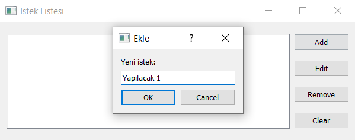
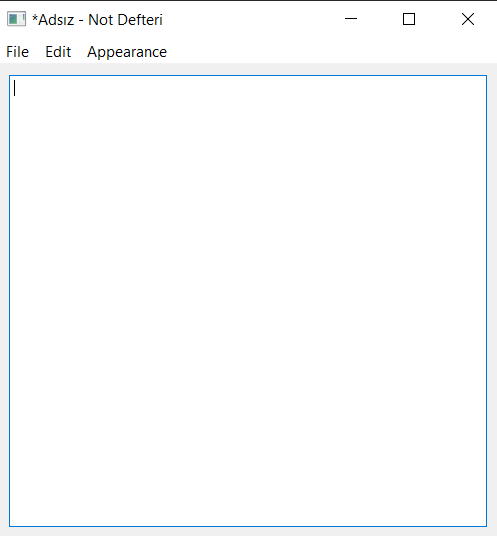
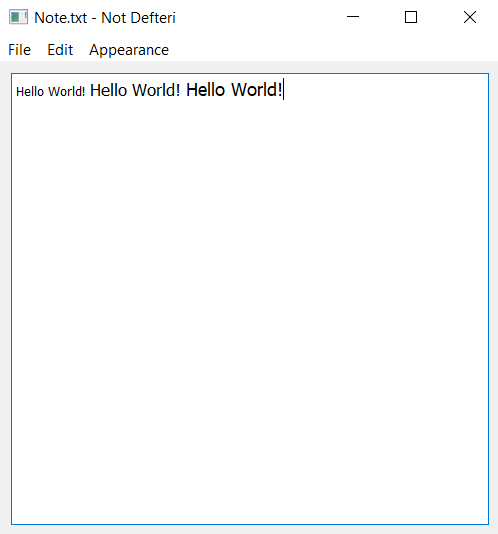

# Proje Adı: PyQt5 Alıştırma Projeleri

Bu proje, Python'ın PyQt5 kütüphanesini kullanarak geliştirilmiş uygulamalar mevcuttur.

### 📸 İstek Listesi Projesi



### ✨ Özellikler

- Listeye istek ekleyebilirsiniz.
- Listeye eklenen istekleri düzenleyebilirsiniz.
- Listede seçili olan isteği silebilirsiniz.
- Listeyi tamamen temizleyebilirsiniz.

### 📸 Not Defteri




### ✨ Özellikler

- **Dosya İşlemleri:** Yeni dosya açma, var olan .txt uzantılı dosyayı açma, kaydetme, farklı kaydetme işlemleri gerçekleştirilebilir.
- **Yazı Düzenleme Araçları:** Yazıları daha kolay düzenleyebilmek için geliştirilen geri alma, ileri alma, kesme, kopyalama, yapıştırma araçlarını kullanabilirsiniz.
- **Uygulama Görünümü:** Uygulamanın arayüzünü karanlık mod ve aydınlık mod olarak ayarlayabilirsiniz.
- **Yazı Büyüklüğünü Değiştirme:** Yazınızı kademeli olarak arttırabilir ve azaltabilirsiniz.

### 🛠 Kullanılan Teknolojiler

- **Programlama Dili:** Python 3
- **Kullanıcı Arayüzü Kütüphanesi:** PyQt5

### 🚀 Kurulum ve Çalıştırma

Bu projeyi bilgisayarınızda çalıştırmak için aşağıdaki adımları takip edin:

1.  **Gerekli Kütüphaneyi Kurun:**
    Terminalinizi açın ve `PyQt5` kütüphanesini yüklemek için aşağıdaki komutu çalıştırın:

    ```bash
    pip install PyQt5
    ```

2.  **Depoyu Klonlayın:**
    Proje dosyalarını indirmek için Git'i kullanarak depoyu klonlayın:

    ```bash
    git clone [https://github.com/Tugbakaraman/PyQt5-AlistirmaProjeleri.git](https://github.com/Tugbakaraman/PyQt5-AlistirmaProjeleri.git)
    ```

3.  **İstek Listesi Klasörüne Gidin:**

    ```bash
    cd PyQt5-AlistirmaProjeleri
    cd IstekListesi
    ```

    **Not Defteri Klasörüne Gidin:**
    '''bash
    cd PyQt5-AlistirmaProjeleri
    cd NotDefteri
    '''

4.  **İstek Listesi veya Not Defteri Uygulamasını Çalıştırın:**
    Aşağıdaki komutla İstek Listesi uygulamasını başlatın:
    ```bash
    python main.py
    ```
